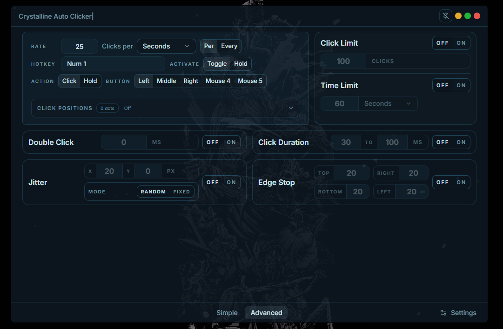
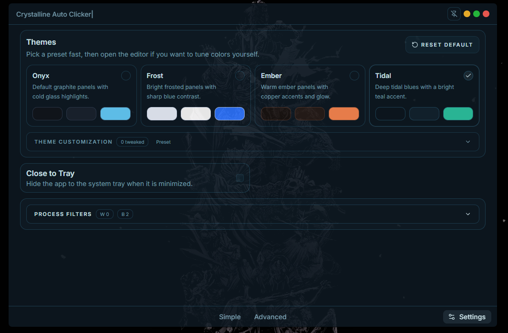
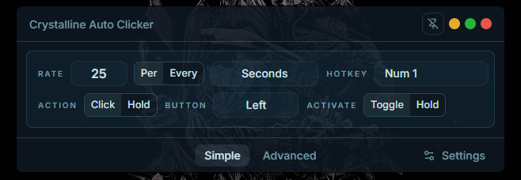

# Crystalline Auto Clicker

Crystalline Auto Clicker is a desktop auto clicker built to feel fast, polished, and modern instead of looking like a throwaway utility. The current release is focused on a strong Windows experience with a custom Tauri desktop UI, flexible hotkeys, advanced click behavior controls, and app-level safety features like edge stop and process filtering.

## Preview

  

  

  

## Current Features

- **Click Rate**  
  Choose `Per` or `Every` timing so the clicker can run as `X clicks per unit` or `one click every X units`.
- **Time Units**  
  Use milliseconds, seconds, minutes, hours, and days where the selected rate mode supports them.
- **Activation Mode**  
  Pick `Toggle` to press once to start and again to stop, or `Hold` to keep the clicker active only while the bound key is held down.
- **Mouse Action**  
  Switch between normal repeated `Click` behavior or a `Hold` action that keeps the selected mouse button pressed.
- **Hotkey Capture**  
  Bind activation keys and click-position controls using keyboard keys, numpad keys, mouse buttons, or the mouse wheel.
- **Mouse Buttons**  
  Target left, middle, right, `Mouse 4`, or `Mouse 5`.
- **App Layouts**  
  Use a compact Simple layout, a full Advanced layout, or the separate Settings view.
- **Click Positions**  
  Save multiple click dots, show or hide their overlay, and place new dots with a dedicated hotkey at the current cursor position.
- **Double Click**  
  Send two clicks per cycle with an adjustable delay between the first and second click.
- **Click Duration**  
  Randomize how long each click is held before release with configurable minimum and maximum timing.
- **Jitter**  
  Move the cursor away from the original point before clicking with `Random` or `Fixed` X/Y pixel offsets.
- **Stop Limits**  
  Automatically turn the clicker off after a chosen number of clicks or after a chosen amount of time.
- **Edge Stop**  
  Use failsafe walls on each side of the screen layout that stop the auto clicker when the cursor touches them.
- **Themes**  
  Choose from presets, edit custom colors, preview edge stop overlay colors, and adjust window opacity.
- **Process Filters**  
  Use whitelist and blacklist rules with live process search, open-app shortcuts, and a click-to-pick tool that lets you click a window to grab its process name before adding it to either list.
- **Click Region**
  Draws a box on your screen that restricts the auto clicker to only work in that selected area when enabled
- **Window Controls**  
  Enable always-on-top and close-to-tray behavior for the desktop window.
- **Saved Settings**  
  Keep your configuration between launches.

## Download

The latest Windows build is available on the [Releases](https://github.com/Encryption-c08/Crystalline-Auto-Clicker/releases) page.

## Building From Source

Visit [docs/BUILDING.md](./docs/BUILDING.md) for building instructions & a dedicated build command

## Why This Exists

Crystalline Auto Clicker started after I came across [Blur Auto Clicker](https://github.com/Blur009/Blur-AutoClicker). I liked the general direction and originally wanted to contribute there, but I wanted faster iteration and a broader feature set than what was available at the time.

Instead of waiting around, I decided to build my own alternative with a similar level of polish but a more ambitious long-term direction. The goal is to give people another serious option and prove an auto clicker does not have to be disposable, outdated, or stripped down to the bare minimum.

I also do not plan for this project to become paid or closed source. I want Crystalline Auto Clicker to stay something people can use, learn from, and build on freely.

## Project Direction

Crystalline Auto Clicker is meant to grow into a broader desktop clicking and input automation tool, not just a bare-bones click repeater. Some of the bigger long-term goals are:

- A cleaner and more capable macro system
- Better runtime visibility through overlays and status feedback
- Profiles that react to specific games or apps
- Import and export support for full settings and macro setups

## Built With

- `Tauri`
- `React`
- `TypeScript`
- `Tailwind CSS`
- `Rust`

## License

This project is licensed under the [GNU General Public License v3.0](./LICENSE).
